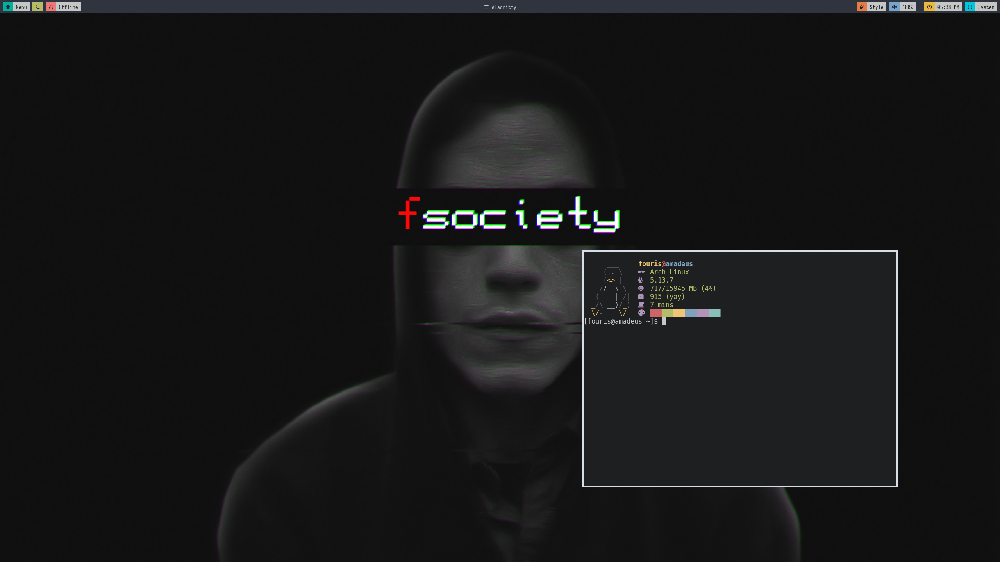

# My first ever rice / arch install

The config sadly was lost, but it was pretty barebones.

While I agree with the suckless philosophy (small and elitist), 
I just don't like tinkering C.

I will update this directory accordingly if I find time to remake it.
